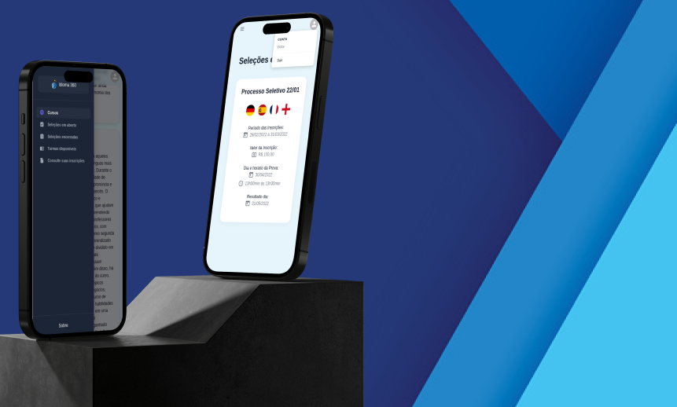
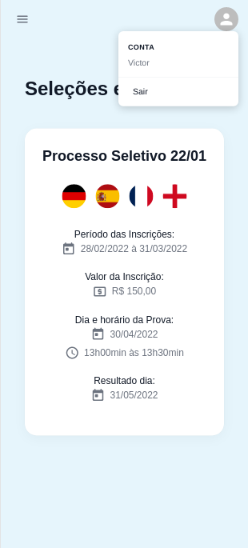

| [:gb:](README.md) | [:brazil:](README_pt.md) |

# Idioma 360 - Front-end

Front-end for Idioma 360, a language course manager. :earth_americas:



## About

Idioma 360 is a comprehensive web application designed for the management of a language course platform. This versatile platform caters to two distinct user roles: administrators and students.

With Idioma 360, administrators have full control over the platform's functionalities. They can effortlessly create, edit, and delete courses, classes, selection processes, and exams. This ensures that administrators have the necessary tools to maintain and enhance the learning experience for students.

Students, on the other hand, benefit from the user-friendly interface of Idioma 360. They have the ability to apply for various selection processes and participate in corresponding tests. This empowers students to actively engage in the language learning journey and showcase their knowledge and skills.

Idioma 360 aims to facilitate selection processes for both organizers and participants. This platform is designed to streamline and simplify the entire selection process experience, benefiting both the organizers and the participants involved.

You can access the back-end repository at [Back-End APP](https://github.com/victor-azevedo/back-idioma360)

## Deploy

You can access the deployed application [here](https://idioma360.vercel.app).
Please note that, as it is a free deployment, there might be a longer loading time when starting the application ⏳. We appreciate your patience 🙏!

## How to run

### Local Option:

#### Requirements

- Have Node.js installed in your machine.
- [Run back-end application](https://github.com/victor-azevedo/back-idioma360)

1. Clone this repository;

```bash
git clone git@github.com:victor-azevedo/front-idioma360.git
cd front-idioma360/
```

2. Install all dependencies:

```bash
npm install
```

3. Create a `.env` file based on the `.env.example`;

4. Build and start the application:

```bash
npm run build
npm start
```

The application will run on the default PORT: 3000.
Note: Default API URL: http://localhost:4000

## Samples

 

 


